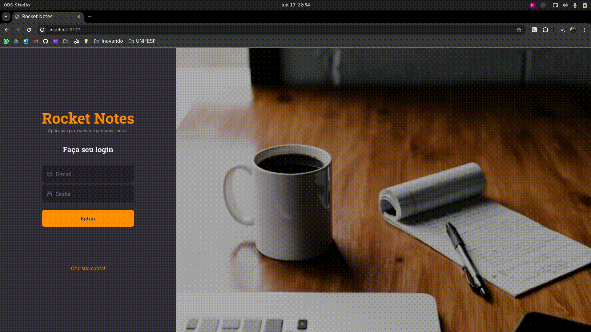

# Rocket Notes

This repository contains the frontend for the "rocket-notes" application, a platform designed for registering and categorizing notes by tags. The primary objective of this project is to practice and improve skills in React.
## Features
- Register new notes
- Categorize notes by tags
- View and manage your notes
## Demonstration

 

## Technologies Used
- React
- JavaScript
- HTML